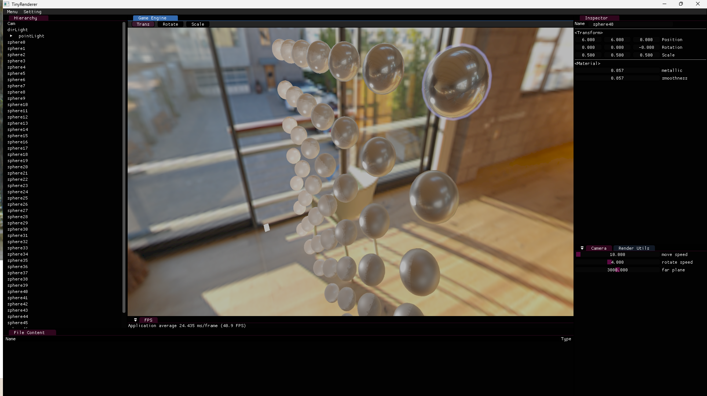
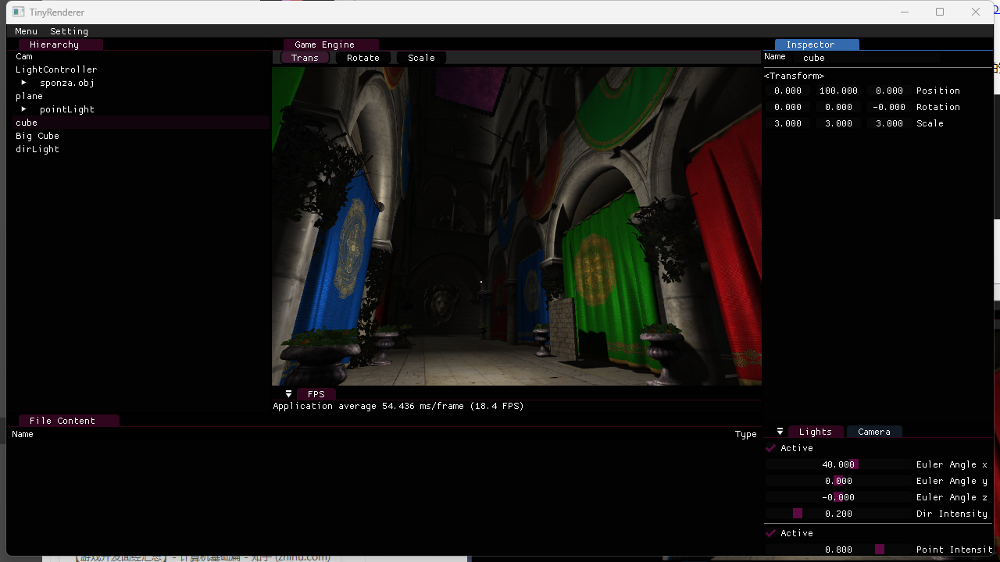
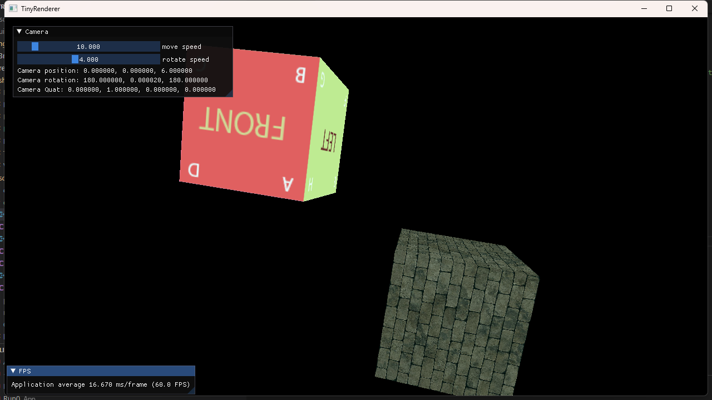
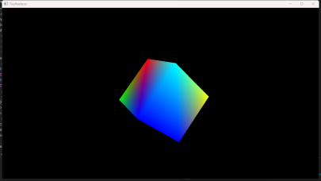

# TinyRenderer-IMGUI
一个基于DX11的渲染引擎（目前仅有渲染部分的内容）

NOTE: 需要首先单独构建assimp，然后构建tinyrenderer，否则无法正常启动。

# 进度情况

&nbsp;
2023-11-3  
添加了对IBL的支持，IrradianceMap和PrefilterMap, BRDFLUT的计算使用了动态计算的方式，运行时会首先依据加载的SkyBox计算效果。

&nbsp;
2023-10-19  
引擎编辑器界面构建：参考了Game104小引擎的`Editor`界面方案。
引入了`RenderGraph`框架：支持多`Pass`扩展。  
   （目前包含了`Shadow Pass`-> `Shading Pass`-> `Skybox Pass`-> `PostProcess Pass`）  
引入了`RenderGraph`的`Resource`概念：支持多Pass共享资源;  
阴影实现了基于硬件的`PCF`滤波  

2023-08-25  
引入了IMGUI库；  
引入了类unity材质机制；  

2023-06-23  
一阶段  
